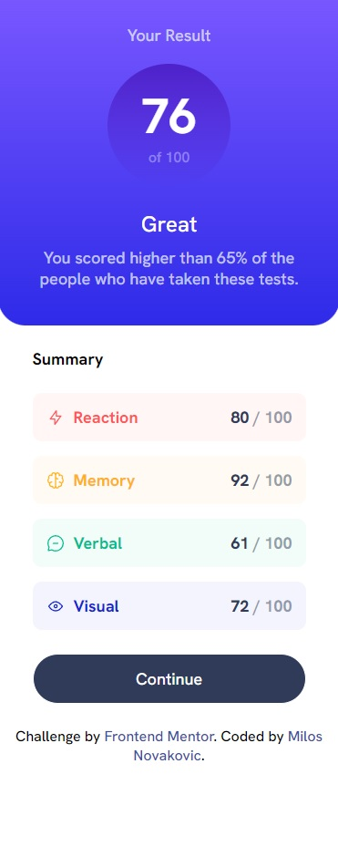

# Frontend Mentor - QR code component solution

This is a solution to the [Results summary component challenge on Frontend Mentor](https://www.frontendmentor.io/challenges/results-summary-component-CE_K6s0maV). Frontend Mentor challenges help you improve your coding skills by building realistic projects.

## Table of contents

- [Overview](#overview)
  - [The challenge](#the-challenge)
  - [Screenshot](#screenshot)
  - [Links](#links)
- [My process](#my-process)
  - [Built with](#built-with)
  - [What I learned](#what-i-learned)
  - [Continued development](#continued-development)
  - [Useful resources](#useful-resources)
- [Author](#author)

## Overview

### The challenge

Users should be able to:

- View the optimal layout for the interface depending on their device's screen size
- See hover and focus states for all interactive elements on the page

### Screenshot
<div>
  
  
</div>

### Links

- Solution URL: [My solution URL](https://github.com/MiloosN5/FrontendMentor_ResultsSummaryComponent_Challenge)
- Live Site URL: [My live site URL](https://miloosn5.github.io/FrontendMentor_ResultsSummaryComponent_Challenge/public/)


## My process

### Built with

- Semantic HTML5 markup
- SASS - compiled into the CSS
- Flexbox
- Grid
- Mobile-first workflow
- REM (Root EM) & EM (for Responsive)
- Responsive layout
- NPM
- JavaScript
- JSON (using Fetch)

### What I learned

The main of this challenge was to make layout responsive. Since there are several ways to do this, in this case was used the grid. It helped you change number of the columns and rows if you need different layout for some breakpoint. 
Changes in the layout of the page are made using media queries. In the media query with use "breakpoint" when we want to change the layout. 
Formatting is done using Live Sass Compiler by Glenn Marks. It can found as a extension of the Visual Studio Code. In this solution, you can see using of different "at-rules" and directives such as: @use, @forward, @if, @else, @error, @return, @mixin, @media, @content, @import ...
Datas can be put directly in the HTML or can be hold in the JSON file and then dynamically fetch with it in the JavaScript. Given that file need to be on the server in order to make fetch, Live Server by Ritwick Dey was used (another extension in the Visual Studio Code). 


  * SASS organization
  ```scss
    .grid {
        display: grid;
        @include u.breakpoint(large) {
            grid-template-columns: repeat(2, 1fr);
        }
        &__score {
            color: g.$white;
            @include u.breakpoint(large) {
                width: u.rem(330);
            }
            &__heading {
                margin-block-start: 8px;
                @include u.breakpoint(large) {
                    margin-block-start: 12px;
                }
            }
            &__number {
                display: flex;
                flex-direction: column;
                align-items: center;
                justify-content: center;
            }
        }
    }
  ```
  * SASS directives and "at-rules"
  ```scss
    @function rem($pixel) {
        @if math.is-unitless($pixel) {
            @return math.div($pixel, 16) + rem;
        } @else {
            @error 'Don\'t use units when using the rem() function, only numbers';
        }
    }
  ```

  * JSON fetch
  ```js
    fetch('data.json')
        .then(function(response){
            return response.json();
        })
        .then(function(item){
            reactionSummary.innerHTML = 
            `
            <h3>${item[0].category}</h3>
            <p><span>${item[0].score}</span> / 100</p>`;
        })
        .catch(err => {
            console.log('errors:' + err.message);
        })
  ```

### Continued development

Aspiration to improve the SASS organization (using partials).

### Useful resources

- [CoderCoder (Youtube)](https://www.youtube.com/watch?v=jfMHA8SqUL4) - Getting to know the basics of the SASS.
- [SASS](https://sass-lang.com/documentation/at-rules) - You can found detailed documentation on the official page of the SASS. Check out for example "at-rules".
- [Media Query](https://css-tricks.com/a-complete-guide-to-css-media-queries/) - A Complete Guide to (CSS) Media Queries.

## Author

- GitHub - [MiloosN5](https://github.com/MiloosN5)
- Frontend Mentor - [@MiloosN5](https://www.frontendmentor.io/profile/MiloosN5)


